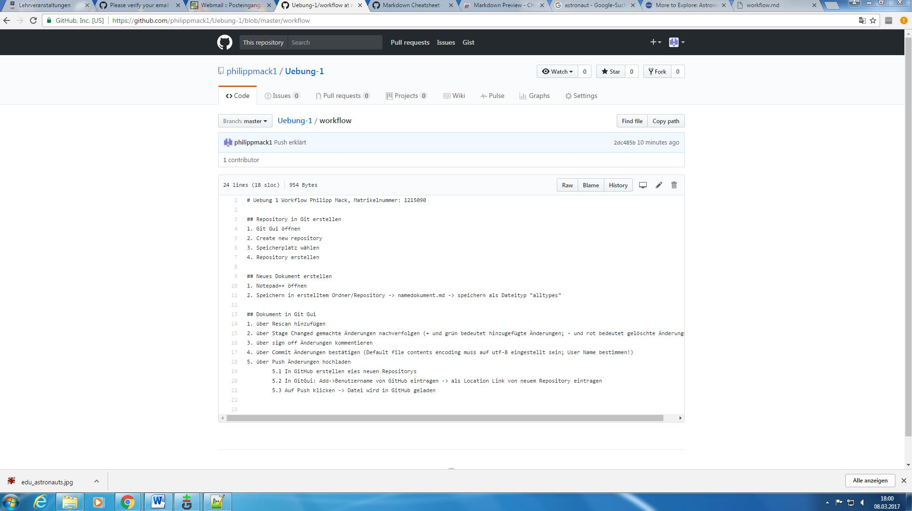
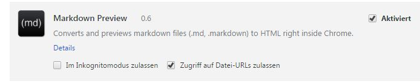

# Uebung 1 Workflow Philipp Mack, Matrikelnummer: 1215090

## Repository in Git erstellen
1. Git Gui öffnen
2. Create new repository
3. Speicherplatz wählen
4. Repository erstellen

## Neues Dokument erstellen
1. Notepad++ öffnen
2. Speichern in erstelltem Ordner/Repository -> namedokument.md -> speichern als Dateityp "alltypes"
3. Anzahl der # bestimmt Grad der Überschrift, weitere Codes unter: 

## Dokument in Git Gui
1. über Rescan hinzufügen
2. über Stage Changed gemachte Änderungen nachverfolgen (+ und grün bedeutet hinzugefügte Änderungen; - und rot bedeutet gelöschte Änderungen)
	* unter repository -> visualize master's history kann man einsehen was von wem wann geändert wurde
3. über sign off Änderungen kommentieren
4. über Commit Änderungen bestätigen (Default file contents encoding muss auf utf-8 eingestellt sein; User Name bestimmen!)
5. über Push Änderungen hochladen
	* In GitHub erstellen eies neuen Repositorys
	* In GitGui: Add->Benutzername von GitHub eintragen -> als Location Link von neuem Repository eintragen 
	* Auf Push klicken -> Datei wird in GitHub geladen

Dokument auf GitHub geladen:

Quelle:Mit Push Datei auf GitHub laden

## Darstellung im Web - Markdown Preview einrichten
1. Markdown Preiew herunterladen unter: (https://chrome.google.com/webstore/detail/markdown-preview/jmchmkecamhbiokiopfpnfgbidieafmd/related) 
2. Hinzufügen
3. Erweiterungen verwalten -> Zugriff auf Datei-URLs zulassen anklicken
4. md-Datei mit drag and drop reinziehen
	
Abbildung URLs zulassen:

Quelle: Eigene Darstellung

## Bild einfügen
1. Gewünschtes Bild in Repository abspeichern
2. mit dem Befehl '' einfügen. Aufpassen: keine Leerzeichen!!

## Link einfügen
mit dem Befehl '', auch hier aufpassen, dass keine Leerzeichen verwendet werden!

	

